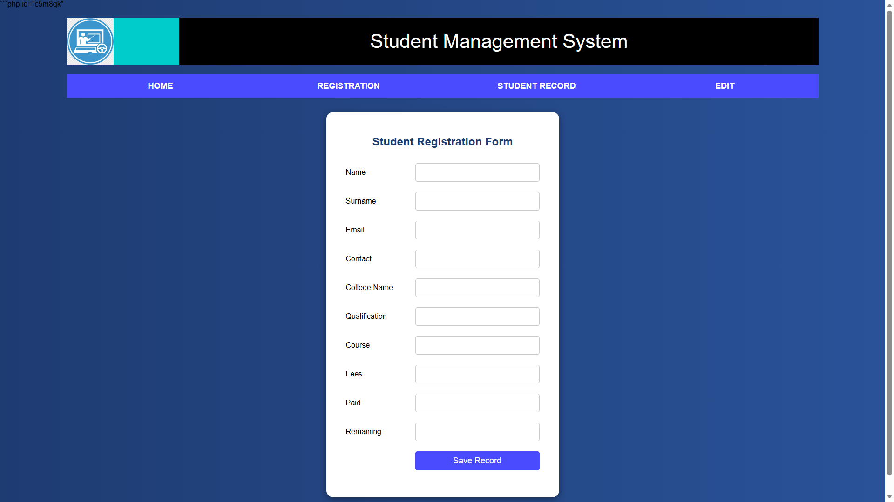
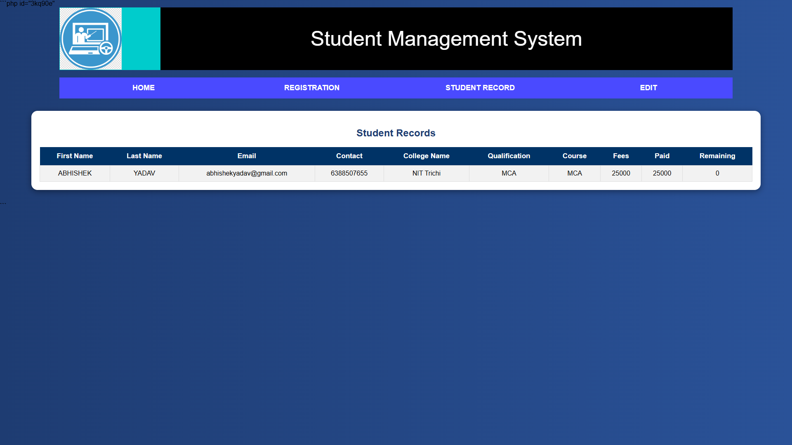
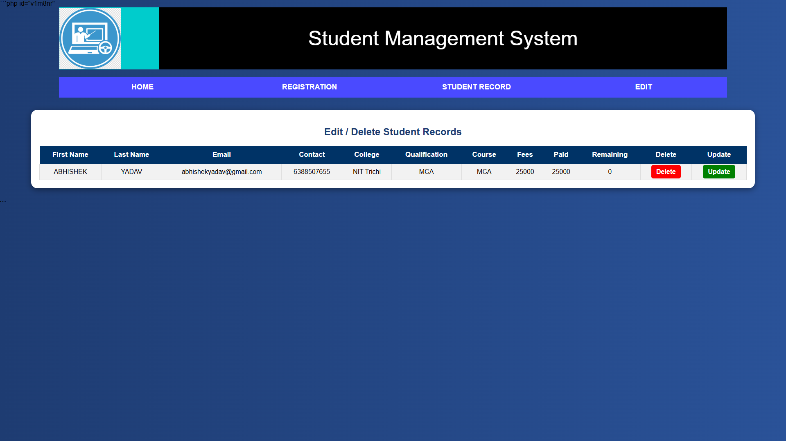

```md id="zbx91p"
# 🎓 Student Management System

A responsive web-based **Student Management System** developed using **PHP, MySQL, HTML, CSS, and XAMPP**.

This project is designed to manage student records efficiently with features like registration, viewing records, updating details, deleting records, and fee management.

---

## 🚀 Features

- ✅ Student Registration
- ✅ View Student Records
- ✅ Update / Edit Details
- ✅ Delete Records
- ✅ Fee Management
- ✅ Responsive User Interface
- ✅ Thank You Page after Registration

---

## 🛠️ Technologies Used

- PHP
- MySQL
- HTML
- CSS
- JavaScript
- XAMPP

---

## 📂 Project Modules

- `index.php` → Home Page
- `reg.php` → Student Registration
- `view.php` → View Records
- `viewdel.php` → Edit / Delete Records
- `update.php` → Update Student Data
- `delete.php` → Delete Record
- `connect.php` → Database Connection

---

## 💻 How to Run

1. Install XAMPP
2. Start Apache and MySQL
3. Copy project folder into `htdocs`
4. Import database into phpMyAdmin
5. Open browser:
   `http://localhost/student-management-system`

---

```md id="hvw4w0"
## 📸 Project Screenshots

### 🏠 Home Page


### 📝 Registration Page


### 📋 Student Records


### ✏️ Edit / Delete Page


### 🎉 Thank You Page

```


## 🔗 GitHub Repository

https://github.com/abhishekyadav071/student-management-system

---

## 👨‍💻 Developed By

**Abhishek Yadav**
```
